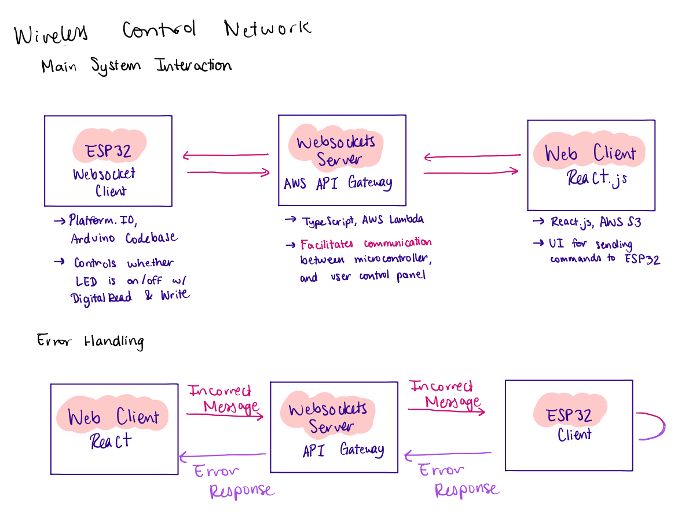

# Wireless Control Network - IN PROGRESS

#### Description
* Developed an ESP32 WebSocket client in C/C++ using PlatformIO, leveraging the ESP32 WiFi connection, adding WebSocket client functionality, and handling WebSocket events in order to facilitate real-time GPIO pin control with the ESP32
* Implemented firmware features including parsing and validating WebSocket message events, integrating pin mode and digital read/write commands, and error handling 
* Integrated the AWS API Gateway WebSockets infrastructure using the Serverless Framework in TypeScript, implementing WebSocket handlers, client connections, disconnections, and message passing. 
* Developed a ReactJS web application for browser-based control of the ESP32, deploying it via AWS S3.

#### Software Architecture

#### Resources

* [esp32-websockets-serverless-handler](https://github.com/ttarnowski/esp32-websockets-serverless-handler)